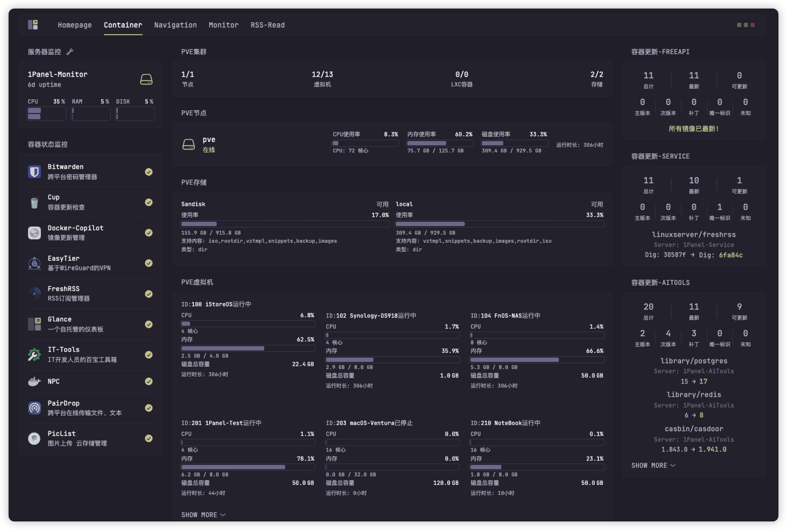
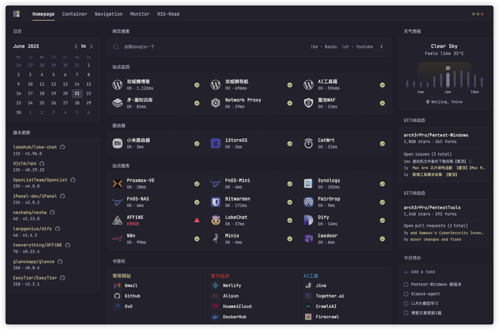
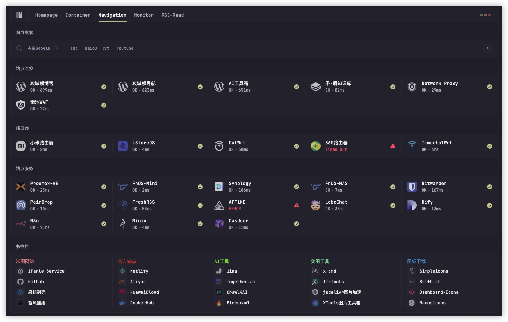

<p align="center"><em>轻量级、可视化服务器监控方案</em></p>
<h1 align="center">Glance-Monitor</h1>
<p align="center"><a href="README_EN.md">English</a> • <a href="./README.md">中文</a> </p>



基于 [Glance](https://github.com/glanceapp/glance) 仪表盘，使用 Custom-API 实现的系统监控组件集合。提供多种监控解决方案，帮助您构建完整的系统监控仪表盘。

## ✨ 功能特性

- 🐳 **容器更新监控** - 实时监控 Docker 容器更新状态
- 🖥️ **远程服务器监控** - 多服务器系统资源监控
- ⚡ **Proxmox VE 监控** - 虚拟化环境集群监控
- 🔧 **易于集成** - 基于 Glance Custom-API，配置简单
- 🌐 **多语言支持** - 提供中英文文档
- 🎨 **高度可定制** - 针对不同用例的灵活配置选项

## 📦 组件列表

### 1. Cup Updates Widget
Docker 容器更新监控组件，支持：
- 容器镜像更新状态总览
- 按类型分类的更新统计（主版本、次版本、补丁等）
- 详细的容器更新信息展示

[查看详情](./cup-updates-widget/README.md) | [English](./cup-updates-widget/README_EN.md)

### 2. Server Status Agent
远程服务器监控代理，支持：
- 多服务器统一监控
- 系统资源实时监控（CPU、内存、磁盘等）
- Docker 容器化部署
- 自动主机名识别

[查看详情](./server-status-agent/README.md)

### 3. Proxmox Stats Widget
Proxmox VE 虚拟化环境监控组件，支持：
- 集群资源概览
- 节点状态监控
- 存储空间监控
- 虚拟机详细状态

[查看详情](./proxmox-stats-widget/README.md) | [English](./proxmox-stats-widget/README_EN.md)

## 🚀 快速开始

### 前置要求

- [Glance Dashboard](https://github.com/glanceapp/glance) 已安装并运行
- 根据组件需求，可能需要：
  - Docker 环境（Cup Updates）
  - Python 3.7+（Server Status Agent）
  - Proxmox VE 环境（Proxmox Stats）

### 安装步骤

1. **克隆项目**
   ```bash
   git clone https://github.com/your-username/Glance-Monitor.git
   cd Glance-Monitor
   ```

2. **选择需要的组件**
   - 容器监控：参考 [Cup Updates Widget](./cup-updates-widget/README.md)
   - 服务器监控：参考 [Server Stats Agent](./server-stats-agent/README.md)
   - 虚拟化监控：参考 [Proxmox Stats Widget](./proxmox-stats-widget/README.md)

3. **配置 Glance**
   - 将组件的配置示例添加到您的 `glance.yml` 文件中
   - 根据实际环境修改配置参数

## 📖 使用示例

### 容器更新监控
```yaml
- type: custom-api
  title: Cup Updates
  cache: 1h
  url: http://${CUP_URL}/api/v3/json
  method: GET
  template: |
    # 配置模板...
```

### 远程服务器监控
```yaml
- type: custom-api
  title: 服务器状态
  url: http://192.168.1.100:8000/api/sysinfo/all
  cache: 15s
  template: |
    # 配置模板...
```

### Proxmox 集群监控
```yaml
- type: custom-api
  title: PVE集群
  url: https://192.168.1.200:8006/api2/json/cluster/resources
  headers:
    Authorization: PVEAPIToken=username@pam!token=secret
  template: |
    # 配置模板...
```

## 🎯 其他使用案例

除了系统监控功能外，Glance 还支持多种丰富的使用场景，为您提供一体化的信息管理解决方案。

### 🏠 Homepage - 个人主页
作为个人仪表盘使用，集成多种实用功能：
- 📅 **日历管理** - 日程安排和重要日期提醒
- 🌤️ **天气信息** - 实时天气数据和预报
- 🔍 **网页搜索** - 快速搜索和导航
- ✅ **今日待办** - 任务管理和进度跟踪
- 🔄 **版本更新** - 监控应用和系统更新
- 📊 **GitHub 动态** - 项目动态和代码更新
- 🌐 **站点监控** - 网站可用性检测
- 📚 **书签管理** - 常用链接快速访问



### 🧭 Navigation - 导航中心
作为网站导航页使用，提供：
- 🎯 **分类导航** - 按功能分类的网站链接
- ⚡ **快速访问** - 常用工具和服务直达
- 🎨 **自定义布局** - 灵活的页面布局配置
- 📱 **响应式设计** - 适配各种设备屏幕



### 📰 RSS Reader - 信息聚合
作为 RSS 阅读器使用，支持：
- 📡 **多源订阅** - 订阅多个 RSS 源
- 📖 **文章预览** - 内容摘要和快速浏览
- 🔄 **实时更新** - 自动获取最新内容
- 📱 **移动友好** - 优化的移动端阅读体验


## 🤝 贡献

欢迎提交 Issue 和 Pull Request！

### 贡献指南

1. Fork 本仓库
2. 创建功能分支 (`git checkout -b feature/AmazingFeature`)
3. 提交更改 (`git commit -m 'Add some AmazingFeature'`)
4. 推送到分支 (`git push origin feature/AmazingFeature`)
5. 开启 Pull Request


## 🙏 致谢

- [Glance](https://github.com/glanceapp/glance) - 优秀的仪表盘框架
- [Cup](https://github.com/gethomepage/homepage) - 容器更新检查工具
- [Proxmox VE](https://www.proxmox.com/) - 企业级虚拟化平台

## 📞 支持

如果您在使用过程中遇到问题，请：

1. 查看对应组件的详细文档
2. 搜索已有的 [Issues](../../issues)
3. 创建新的 Issue 描述您的问题

---

**⭐ 如果这个项目对您有帮助，请给我们一个星标！**
