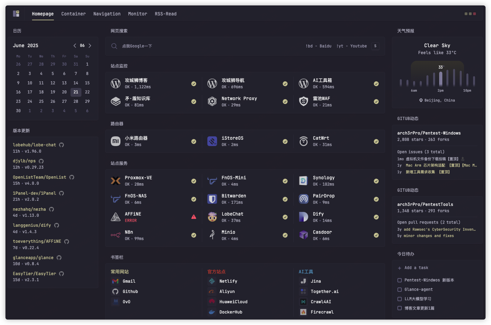
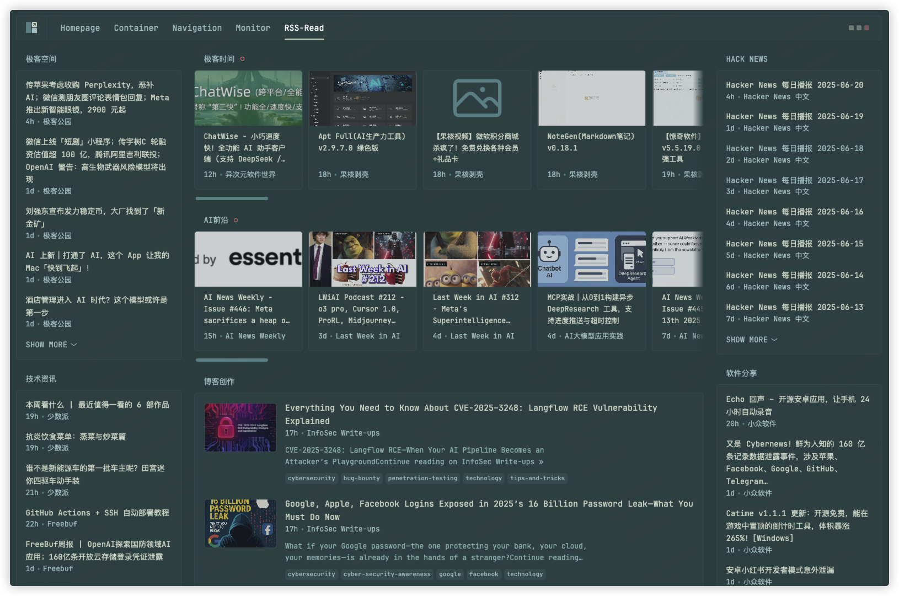

<p align="center"><em>Lightweight, Visual Server Monitoring Solution</em></p>
<h1 align="center">Glance-Monitor</h1>
<p align="center"><a href="./README_EN.md">English</a> • <a href="./README.md">中文</a></p>


A collection of system monitoring components built with Custom-API for [Glance](https://github.com/glanceapp/glance) dashboard. Provides multiple monitoring solutions to help you build a comprehensive system monitoring dashboard.

## ✨ Features

- 🐳 **Container Update Monitoring** - Real-time Docker container update status monitoring
- 🖥️ **Remote Server Monitoring** - Multi-server system resource monitoring
- ⚡ **Proxmox VE Monitoring** - Virtualization environment cluster monitoring
- 🔧 **Easy Integration** - Based on Glance Custom-API, simple configuration
- 🌐 **Multi-language Support** - Documentation in Chinese and English
- 🎨 **Highly Customizable** - Flexible configuration options for different use cases

## 📦 Components

### 1. Cup Updates Widget
Docker container update monitoring component, supporting:
- Container image update status overview
- Update statistics by type (Major, Minor, Patch, etc.)
- Detailed container update information display

[View Details](./cup-updates-widget/README_EN.md) | [中文](./cup-updates-widget/README.md)

### 2. Server Status Agent
Remote server monitoring agent, supporting:
- Unified monitoring of multiple servers
- Real-time system resource monitoring (CPU, memory, disk, etc.)
- Docker containerized deployment
- Automatic hostname detection

[View Details](./server-stats-agent/README.md)

### 3. Proxmox Stats Widget
Proxmox VE virtualization environment monitoring component, supporting:
- Cluster resource overview
- Node status monitoring
- Storage space monitoring
- Detailed virtual machine status

[View Details](./proxmox-stats-widget/README_EN.md) | [中文](./proxmox-stats-widget/README.md)

## 🚀 Quick Start

### Prerequisites

- [Glance Dashboard](https://github.com/glanceapp/glance) installed and running
- Depending on component requirements, you may need:
  - Docker environment (Cup Updates)
  - Python 3.7+ (Server Status Agent)
  - Proxmox VE environment (Proxmox Stats)

### Installation Steps

1. **Clone the repository**
   ```bash
   git clone https://github.com/your-username/Glance-Monitor.git
   cd Glance-Monitor
   ```

2. **Choose the components you need**
   - Container monitoring: Refer to [Cup Updates Widget](./cup-updates-widget/README_EN.md)
   - Server monitoring: Refer to [Server Status Agent](./server-stats-agent/README.md)
   - Virtualization monitoring: Refer to [Proxmox Stats Widget](./proxmox-stats-widget/README_EN.md)

3. **Configure Glance**
   - Add component configuration examples to your `glance.yml` file
   - Modify configuration parameters according to your actual environment

## 📖 Usage Examples

### Container Update Monitoring
```yaml
- type: custom-api
  title: Cup Updates
  cache: 1h
  url: http://${CUP_URL}/api/v3/json
  method: GET
  template: |
    # Configuration template...
```

### Remote Server Monitoring
```yaml
- type: custom-api
  title: Server Status
  url: http://192.168.1.100:8000/api/sysinfo/all
  cache: 15s
  template: |
    # Configuration template...
```

### Proxmox Cluster Monitoring
```yaml
- type: custom-api
  title: PVE Cluster
  url: https://192.168.1.200:8006/api2/json/cluster/resources
  headers:
    Authorization: PVEAPIToken=username@pam!token=secret
  template: |
    # Configuration template...
```

## 🎯 Other Use Cases

Beyond system monitoring capabilities, Glance also supports various rich usage scenarios, providing you with an integrated information management solution.

### 🏠 Homepage - Personal Dashboard
Serves as a personal dashboard with multiple practical features:
- 📅 **Calendar Management** - Schedule planning and important date reminders
- 🌤️ **Weather Information** - Real-time weather data and forecasts
- 🔍 **Web Search** - Quick search and navigation
- ✅ **Today's Tasks** - Task management and progress tracking
- 🔄 **Version Updates** - Monitor application and system updates
- 📊 **GitHub Activity** - Project dynamics and code updates
- 🌐 **Site Monitoring** - Website availability detection
- 📚 **Bookmark Management** - Quick access to frequently used links



### 🧭 Navigation - Navigation Center
Serves as a website navigation page, providing:
- 🎯 **Categorized Navigation** - Website links organized by function
- ⚡ **Quick Access** - Direct access to common tools and services
- 🎨 **Custom Layout** - Flexible page layout configuration
- 📱 **Responsive Design** - Adapts to various device screens


### 📰 RSS Reader - Information Aggregation
Serves as an RSS reader, supporting:
- 📡 **Multi-source Subscription** - Subscribe to multiple RSS feeds
- 📖 **Article Preview** - Content summaries and quick browsing
- 🔄 **Real-time Updates** - Automatically fetch latest content
- 📱 **Mobile Friendly** - Optimized mobile reading experience



## 🤝 Contributing

Issues and Pull Requests are welcome!

### Contributing Guidelines

1. Fork this repository
2. Create a feature branch (`git checkout -b feature/AmazingFeature`)
3. Commit your changes (`git commit -m 'Add some AmazingFeature'`)
4. Push to the branch (`git push origin feature/AmazingFeature`)
5. Open a Pull Request


## 🙏 Acknowledgments

- [Glance](https://github.com/glanceapp/glance) - Excellent dashboard framework
- [Cup](https://github.com/gethomepage/homepage) - Container update checking tool
- [Proxmox VE](https://www.proxmox.com/) - Enterprise virtualization platform

## 📞 Support

If you encounter issues while using this project, please:

1. Check the detailed documentation for the corresponding component
2. Search existing [Issues](../../issues)
3. Create a new Issue describing your problem

---

**⭐ If this project helps you, please give us a star!** 