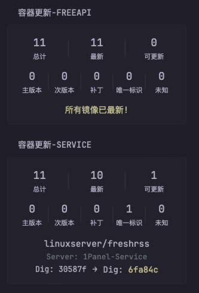

# Cup Updates 小组件文档

[English README](./README_EN.md)

## 概述

Cup Updates 小组件为您的 Docker 环境提供了一个仪表盘界面，用于监控容器更新状态。它可显示汇总统计信息以及需要更新的容器的详细信息。




## 功能特性

- **状态总览**：一目了然地查看已监控镜像总数、已是最新的镜像数和可用更新数
- **更新类型分布**：按类型（主版本、次版本、补丁、摘要、未知）查看更新分布
- **容器详情**：对于有可用更新的每个容器，显示：
  - 容器仓库名并带有源链接（Docker Hub、GitHub 等）
  - 当前版本与新版本
  - 如有，显示摘要信息

## 安装与配置

### 配置方法

在您的仪表盘配置中添加如下内容：

```yaml
- type: custom-api
  title: Cup Updates
  cache: 1h
  url: http://${CUP_URL}/api/v3/json
  method: GET
  template: |
    {{ $defaultServerName := "Glance" }}  {{/* 设置默认服务器名称 */}}
    {{ $showUpdateKind := true }}  {{/* 设为 false 可隐藏更新类型行 */}}
    {{ $filterInactiveImages := true }}  {{/* 设为 false 不过滤未使用镜像 */}}

    <style>
      .vertical-separator-cup {
        width: 3px;
        height: 3.5rem;
        margin: 0 1rem;
        border-radius: 2px;
        align-self: center;
        background: linear-gradient(to bottom, transparent, rgba(255,255,255,0.05) 20%, rgba(255,255,255,0.05) 80%, transparent);
      }
      .container-list-cup li {
        text-align: center;
        margin-top: 1.5rem;
      }
      .container-list-cup {
        padding: 0;
        margin: 0;
        line-height: 1.2;
      }
      .container-list-cup a {
        text-decoration: none;
        display: block;
        padding: 1px 0;
        font-size: 1.1rem;
        margin-top: 1rem;
      }
      .status-values-cup {
        font-size: 1.8rem;
      }
    </style>

    <div class="flex flex-column gap-4">
      <div class="flex items-center text-center">
        <div class="flex-1">
          <div class="status-values-cup size-h3">{{ .JSON.Int "metrics.monitored_images" }}</div>
          <div class="size-h6">总数</div>
        </div>
        <div class="vertical-separator-cup"></div>
        <div class="flex-1">
          <div class="status-values-cup size-h3">{{ .JSON.Int "metrics.up_to_date" }}</div>
          <div class="size-h6">已是最新</div>
        </div>
        <div class="vertical-separator-cup"></div>
        <div class="flex-1">
          <div class="status-values-cup size-h3">{{ .JSON.Int "metrics.updates_available" }}</div>
          <div class="size-h6">有可用更新</div>
        </div>
      </div>

      {{ if $showUpdateKind }}
        <div class="flex items-center text-center" style="margin-top: 1rem;">
          <div class="flex-1">
            <div class="status-values-cup size-h3">{{ .JSON.Int "metrics.major_updates" }}</div>
            <div class="size-h6">主版本</div>
          </div>
          <div class="vertical-separator-cup" style="width: 2px; margin: 0 0.25rem;"></div>
          <div class="flex-1">
            <div class="status-values-cup size-h3">{{ .JSON.Int "metrics.minor_updates" }}</div>
            <div class="size-h6">次版本</div>
          </div>
          <div class="vertical-separator-cup" style="width: 2px; margin: 0 0.25rem;"></div>
          <div class="flex-1">
            <div class="status-values-cup size-h3">{{ .JSON.Int "metrics.patch_updates" }}</div>
            <div class="size-h6">补丁</div>
          </div>
          <div class="vertical-separator-cup" style="width: 2px; margin: 0 0.25rem;"></div>
          <div class="flex-1">
            <div class="status-values-cup size-h3">{{ .JSON.Int "metrics.other_updates" }}</div>
            <div class="size-h6">摘要</div>
          </div>
          <div class="vertical-separator-cup" style="width: 2px; margin: 0 0.25rem;"></div>
          <div class="flex-1">
            <div class="status-values-cup size-h3">{{ .JSON.Int "metrics.unknown_updates" }}</div>
            <div class="size-h6">未知</div>
          </div>
        </div>
      {{ end }}

      <div class="container-list-cup">
        <ul class="list list-gap-10-cup collapsible-container" data-collapse-after="3">
          {{ $hasUpdates := false }}
          {{ range .JSON.Array "images" }}
            {{ $inUse := .Bool "in_use" }}
            {{ if or (not $filterInactiveImages) $inUse }}
              {{ if .Bool "result.has_update" }}
                {{ $hasUpdates = true }}
                <li>
                  {{ $registry := .String "parts.registry" }}
                  {{ $repository := .String "parts.repository" }}
                  {{ $url := "#" }}

                  {{ if eq $registry "registry-1.docker.io" }}
                    {{ $url = printf "https://hub.docker.com/r/%s" $repository }}
                  {{ else if eq $registry "ghcr.io" }}
                    {{ $url = printf "https://github.com/%s" $repository }}
                  {{ else if eq $registry "lscr.io" }}
                    {{ if .String "url" }}
                      {{ $url = .String "url" }}
                    {{ else }}
                      {{ $url = printf "https://fleet.linuxserver.io/%s" $repository }}
                    {{ end }}
                  {{ end }}

                  <a class="block text-truncate" href="{{ $url }}" target="_blank" rel="noreferrer" style="font-size: 1.47rem;">{{ $repository }}</a>

                  {{ $currentVersion := .String "result.info.current_version" }}
                  {{ $newVersion := .String "result.info.new_version" }}
                  {{ $localDigests := .Array "result.info.local_digests" }}
                  {{ $remoteDigest := .String "result.info.remote_digest" }}
                  {{ $serverName := .String "server" }}

                  {{ if or (eq $serverName "") (eq $serverName "null") (not $serverName) }}
                    {{ $serverName = $defaultServerName }}
                  {{ end }}

                  <div style="margin: 0.5rem 0; font-size: 1.28rem; color: #6c757d;">
                    服务器：{{ $serverName }}
                  </div>

                  {{ if and $currentVersion $newVersion }}
                    <div style="margin: 0.2rem 0;">
                      <span>{{ $currentVersion }}</span>
                      <span> → </span>
                      <span class="size-h4 color-positive">{{ $newVersion }}</span>
                    </div>
                  {{ end }}

                  {{ if $localDigests }}
                    {{ $digest := index $localDigests 0 }}
                    {{ $digestStr := printf "%s" $digest }}
                    {{ $remoteDigestStr := printf "%s" $remoteDigest }}

                    {{ $shortLocal := slice $digestStr 8 14 }}
                    {{ $shortRemote := slice $remoteDigestStr 7 13 }}

                    <div class="flex gap-10 justify-center items-center" style="margin-top: 0.5rem;">
                      <span>本地摘要: {{ $shortLocal }}</span>
                      <span>→</span>
                      <span class="size-h4">远程摘要: <span class="color-positive">{{ $shortRemote }}</span></span>
                    </div>
                  {{ end }}
                </li>
              {{ end }}
            {{ end }}
          {{ end }}

          {{ if not $hasUpdates }}
            <div class="flex items-center justify-center" style="margin-top: 1.5rem;">
              <span class="color-positive size-h4">所有镜像均为最新！</span>
            </div>
          {{ end }}
        </ul>
      </div>
    </div>
```

### 环境变量

- `CUP_URL`：Cup Update 服务器的 IP 地址或主机名
  - 示例：`CUP_URL=IP:PORT`

### 配置选项

可以通过以下变量自定义显示行为和默认标签：

```go
{{ $defaultServerName := "Glance" }}  {{/* 设置默认服务器名称 */}}
{{ $showUpdateKind := true }}         {{/* 设为 false 可隐藏更新类型行 */}}
{{ $filterInactiveImages := true }}  {{/* 设为 false 不过滤未使用镜像 */}}
```

#### `$defaultServerName`

* **作用：** 设置显示的默认服务器名称。
* **默认值：** `"Glance"`
* **自定义：** 修改为您喜欢的服务器名称。

#### `$showUpdateKind`

* **作用：** 控制是否显示更新类型（主版本、次版本、补丁、摘要、未知）。
* **默认值：** `true`（显示更新类型）
* **自定义：**
  * 设为 `true` **显示**更新类型分布
  * 设为 `false` **隐藏**更新类型，界面更紧凑

## 显示说明

### 状态指示器

- **总数**：被监控的容器镜像总数
- **已是最新**：运行最新版本的镜像数量
- **有可用更新**：有可用更新的镜像数量

### 更新类型

- **主版本**：有主版本号更新的镜像（如 v1.x → v2.x）
- **次版本**：有次版本号更新的镜像（如 v1.1 → v1.2）
- **补丁**：有补丁号更新的镜像（如 v1.1.1 → v1.1.2）
- **摘要**：仅摘要变化但无版本号变化的镜像
- **未知**：无法分类的更新类型

<hr>

**组件说明**
该组件源自Glance官方仓库中的第三方组件，此处仅做了部分汉化[cup-updates-by-panonim](https://github.com/glanceapp/community-widgets/blob/main/widgets/cup-updates-by-panonim/README.md)


---
