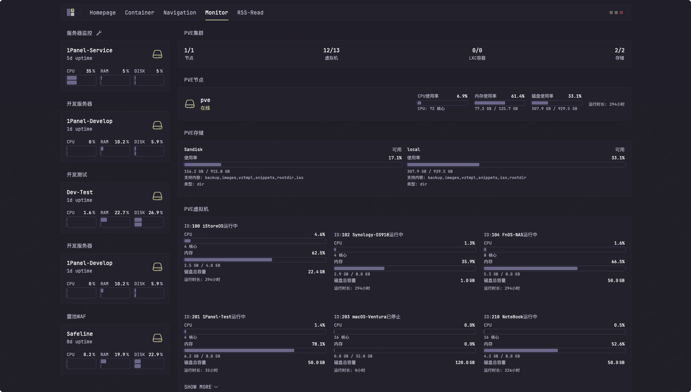
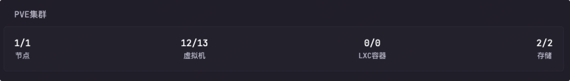
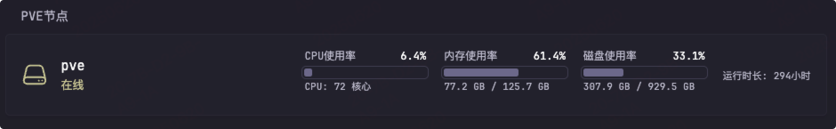
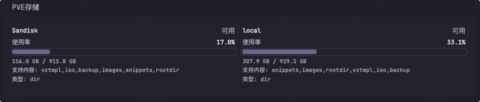

# Proxmox Stats Widget

本插件用于通过 Proxmox VE API 获取集群、节点、存储、虚拟机等多维度的实时状态数据，并以可视化方式展示在 Glance 或其他支持自定义 API 数据源的面板中。适用于需要集中监控 Proxmox 集群资源和虚拟化环境健康状况的场景。

[English Version](./README_EN.md)


## 预览效果



## Proxmox API获取

### 1. Proxmox URL
Proxmox VE 服务器的 URL 地址

### 2. Proxmox API Token
你需要为此生成一个 API Token，如果还没有，请按照以下步骤操作：

1. 进入 Proxmox 管理后台，点击 Datacenter（数据中心）
2. 展开"Permissions（权限）"，点击"Groups（用户组）"
3. 点击"Create（创建）"按钮
4. 给用户组起一个有意义的名字，比如 `api-ro-users`（"ro" 代表只读）
5. 点击"Permissions（权限）"文件夹
6. 点击"Add -> Group Permission（添加 -> 用户组权限）"
    - 路径（Path）：/
    - 用户组（Group）：上面第 4 步创建的用户组
    - 角色（Role）：PVEAuditor（只读审计员）
    - 继承（Propagate）：勾选
7. 展开"Permissions（权限）"，点击"Users（用户）"
8. 点击"Add（添加）"按钮
    - 用户名（User name）：如 `api`，便于识别
    - 域（Realm）：Linux PAM 标准认证
    - 用户组（Group）：第 4 步创建的用户组
9. 展开"Permissions（权限）"，点击"API Tokens（API 令牌）"
10. 点击"Add（添加）"按钮
    - 用户（User）：第 8 步创建的用户
    - Token ID：如 `shared` 或 `glance`，便于识别用途
    - 权限分离（Privilege Separation）：勾选
11. 返回"Permissions（权限）"菜单
12. 点击"Add -> API Token Permission（添加 -> API 令牌权限）"
    - 路径（Path）：/
    - API 令牌（API Token）：选择第 10 步创建的 Token ID
    - 角色（Role）：PVE Auditor
    - 继承（Propagate）：勾选

你的密钥格式应如下所示：`<用户名>@pam!<tokenID>=<secret>`

示例：
```
api@pam!shared=some-random-secret-value-here
```

参考来源: [gethomepage 的文档](https://github.com/gethomepage/homepage/blob/main/docs/widgets/services/proxmox.md)

## Glance 配置文件

### 1. PVE集群概览
基于 `cluster/resources` API 获取集群整体资源信息。



```yaml
- type: custom-api
  title: PVE集群
  cache: 15s
  url: https://192.168.1.200:12080/api2/json/cluster/resources   # <--- 修改为你的PVE API地址
  allow-insecure: true
  headers:
    Accept: application/json
    Authorization: PVEAPIToken=username@pam!glance=xxxxxxxx-xxxx-xxxx-xxxx-xxxxxxxxx   # <--- 修改为你的Token
  # 其他内容可根据需要调整
```
**完整配置请参考 [proxmox-ve-stats.yml](./proxmox-ve-stats.yml)**

### 2. PVE节点（物理机）
基于 `cluster/resources` API 获取节点（物理机）信息。



```yaml
- type: custom-api
  title: PVE节点
  cache: 15s
  url: https://192.168.1.200:12080/api2/json/cluster/resources   # <--- 修改为你的PVE API地址
  allow-insecure: true
  headers:
    Accept: application/json
    Authorization: PVEAPIToken=username@pam!glance=xxxxxxxx-xxxx-xxxx-xxxx-xxxxxxxxx   # <--- 修改为你的Token
  # 其他内容可根据需要调整
```
**完整配置请参考 [proxmox-ve-stats.yml](./proxmox-ve-stats.yml)**

### 3. PVE存储
基于 `cluster/resources` API 获取存储信息。



```yaml
- type: custom-api
  title: PVE存储
  cache: 30s
  url: https://192.168.1.200:12080/api2/json/cluster/resources   # <--- 修改为你的PVE API地址
  allow-insecure: true
  headers:
    Accept: application/json
    Authorization: PVEAPIToken=username@pam!glance=xxxxxxxx-xxxx-xxxx-xxxx-xxxxxxxxx   # <--- 修改为你的Token
  # 其他内容可根据需要调整
```
**完整配置请参考 [proxmox-ve-stats.yml](./proxmox-ve-stats.yml)**

### 4. PVE虚拟机详细监控
基于 `cluster/resources` API 获取虚拟机详细监控数据。


```yaml
- type: custom-api
  title: PVE虚拟机
  cache: 15s
  url: https://192.168.1.200:12080/api2/json/cluster/resources   # <--- 修改为你的PVE API地址
  allow-insecure: true
  headers:
    Accept: application/json
    Authorization: PVEAPIToken=username@pam!glance=xxxxxxxx-xxxx-xxxx-xxxx-xxxxxxxxx   # <--- 修改为你的Token
  # 其他内容可根据需要调整
```
**完整配置请参考 [proxmox-ve-stats.yml](./proxmox-ve-stats.yml)**

