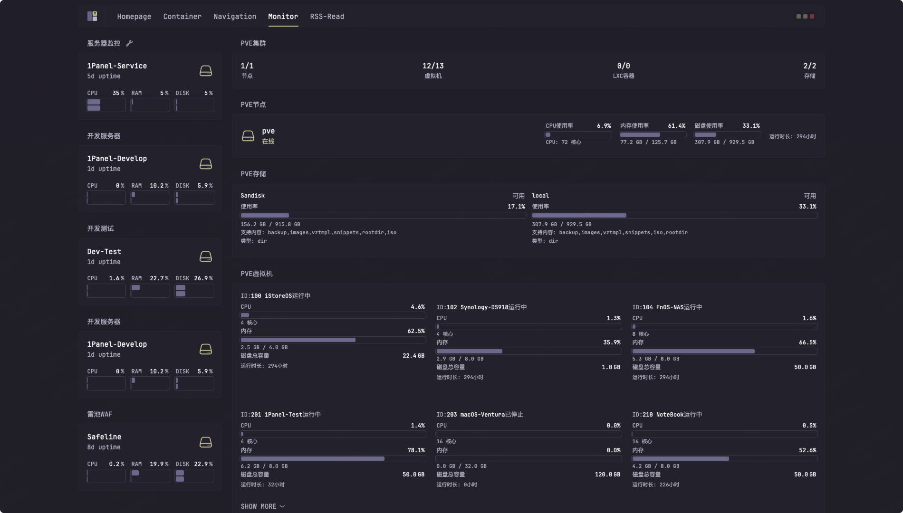
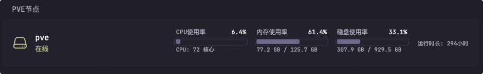
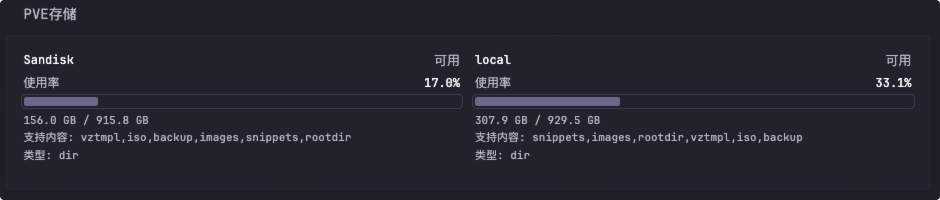
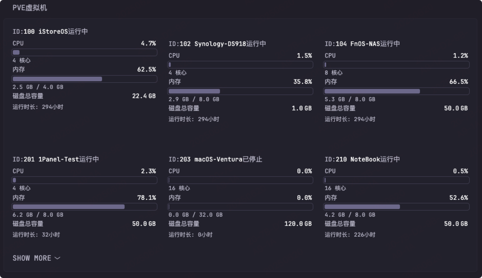

# Proxmox Stats Widget

This plugin fetches real-time statss data of clusters, nodes, storage, and virtual machines from the Proxmox VE API, and visualizes them in Glance or any dashboard supporting custom API data sources. It is ideal for scenarios where you need centralized monitoring of Proxmox cluster resources and virtualization environment health.

[中文版（Chinese Version）](./README.md)

## Rreview




## Proxmox API Access

### 1. Proxmox URL
The URL of your Proxmox VE server.

### 2. Proxmox API Token
You need to generate an API Token for this. If you don't have one, follow these steps:

1. Go to the Proxmox web portal and click Datacenter.
2. Expand "Permissions" and click "Groups".
3. Click the "Create" button.
4. Name the group something meaningful, such as `api-ro-users` ("ro" means read-only).
5. Click the "Permissions" folder.
6. Click "Add -> Group Permission".
    - Path: /
    - Group: the group created in step 4
    - Role: PVEAuditor (read-only)
    - Propagate: checked
7. Expand "Permissions" and click "Users".
8. Click the "Add" button.
    - User name: something meaningful, e.g. `api`
    - Realm: Linux PAM standard authentication
    - Group: the group created in step 4
9. Expand "Permissions" and click "API Tokens".
10. Click the "Add" button.
    - User: the user created in step 8
    - Token ID: something meaningful, e.g. `shared` or `glance`
    - Privilege Separation: checked
11. Go back to the "Permissions" menu.
12. Click "Add -> API Token Permission".
    - Path: /
    - API Token: select the Token ID created in step 10
    - Role: PVE Auditor
    - Propagate: checked

Your key should look like: `<username>@pam!<tokenID>=<secret>`

Example:
```
api@pam!shared=some-random-secret-value-here
```

Reference: [gethomepage documentation](https://github.com/gethomepage/homepage/blob/main/docs/widgets/services/proxmox.md)

## Glance Configuration Example

### 1. PVE Cluster Overview
Get overall cluster resource info via `cluster/resources` API.


```yaml
- type: custom-api
  title: PVE Cluster
  cache: 15s
  url: https://192.168.1.200:12080/api2/json/cluster/resources   # <--- Change to your PVE API address
  allow-insecure: true
  headers:
    Accept: application/json
    Authorization: PVEAPIToken=username@pam!glance=xxxxxxxx-xxxx-xxxx-xxxx-xxxxxxxxx   # <--- Change to your Token
  # Adjust other fields as needed
```
**For the full configuration, see [proxmox-ve-stats.yml](./proxmox-ve-stats.yml)**

### 2. PVE Nodes (Physical Machines)
Get node (physical machine) info via `cluster/resources` API.



```yaml
- type: custom-api
  title: PVE Node
  cache: 15s
  url: https://192.168.1.200:12080/api2/json/cluster/resources   # <--- Change to your PVE API address
  allow-insecure: true
  headers:
    Accept: application/json
    Authorization: PVEAPIToken=username@pam!glance=xxxxxxxx-xxxx-xxxx-xxxx-xxxxxxxxx   # <--- Change to your Token
  # Adjust other fields as needed
```
**For the full configuration, see [proxmox-ve-stats.yml](./proxmox-ve-stats.yml)**

### 3. PVE Storage
Get storage info via `cluster/resources` API.



```yaml
- type: custom-api
  title: PVE Storage
  cache: 30s
  url: https://192.168.1.200:12080/api2/json/cluster/resources   # <--- Change to your PVE API address
  allow-insecure: true
  headers:
    Accept: application/json
    Authorization: PVEAPIToken=username@pam!glance=xxxxxxxx-xxxx-xxxx-xxxx-xxxxxxxxx   # <--- Change to your Token
  # Adjust other fields as needed
```
**For the full configuration, see [proxmox-ve-stats.yml](./proxmox-ve-stats.yml)**

### 4. PVE VM Detailed Monitoring
Get detailed VM monitoring data via `cluster/resources` API.



```yaml
- type: custom-api
  title: PVE VM
  cache: 15s
  url: https://192.168.1.200:12080/api2/json/cluster/resources   # <--- Change to your PVE API address
  allow-insecure: true
  headers:
    Accept: application/json
    Authorization: PVEAPIToken=username@pam!glance=xxxxxxxx-xxxx-xxxx-xxxx-xxxxxxxxx   # <--- Change to your Token
  # Adjust other fields as needed
```
**For the full configuration, see [proxmox-ve-stats.yml](./proxmox-ve-stats.yml)**
